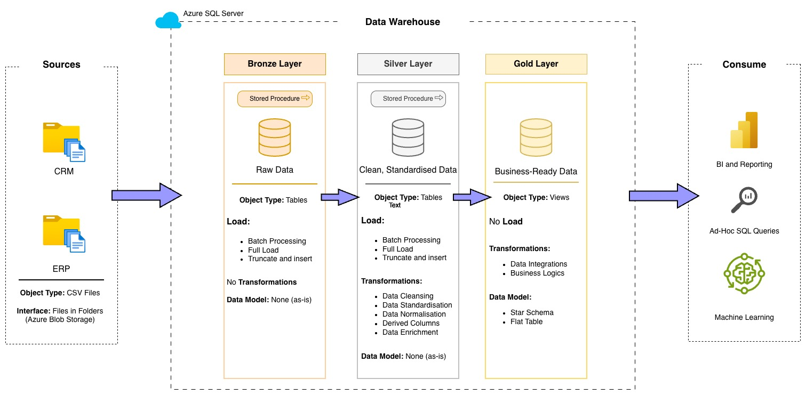
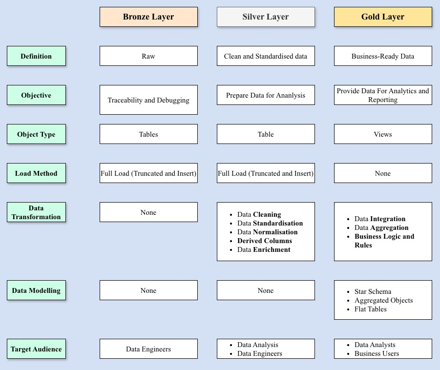
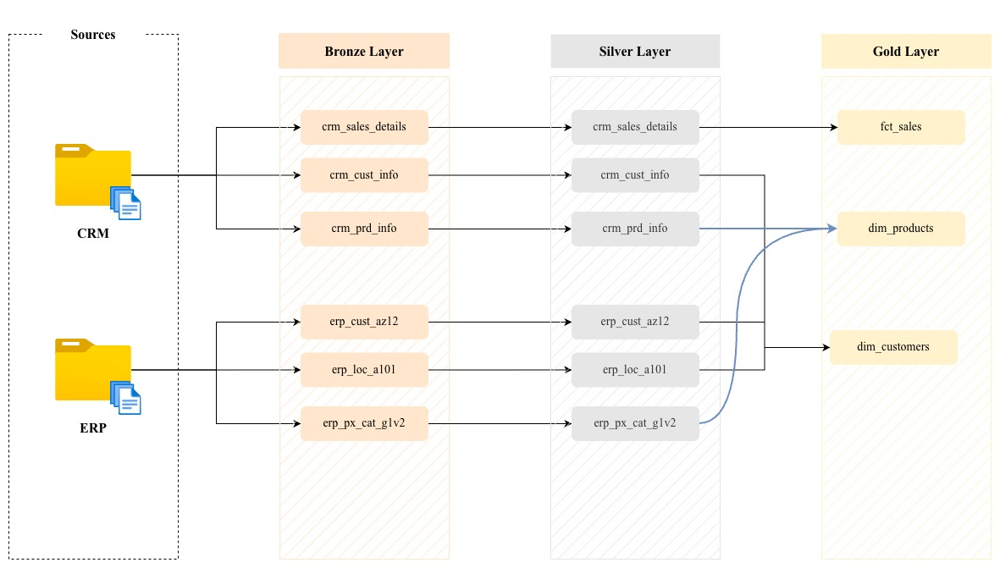
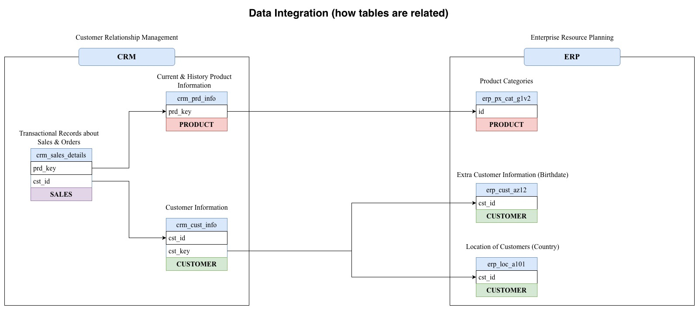
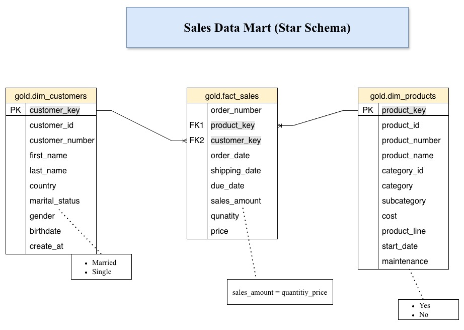

# sql-data-warehouse-project
Building a modern data warehouse with Azure SQL Server, including ETL processes, data modelling and analytics. 

## High Level Architecture:

## Project Overview:

This project implements Data Warehouse using Medallion Architecture(Bronze, Silver and Gold layers) and Star Schema for the resulting Data Mart (Fact and Dimension tables).

### Process Flow:

### Data Layers:

### Data Flow:

### Data Integration:

### Data Mart:

## Data Catalog:
- [Data Catalog](docs/data_catalog.md) for this project.